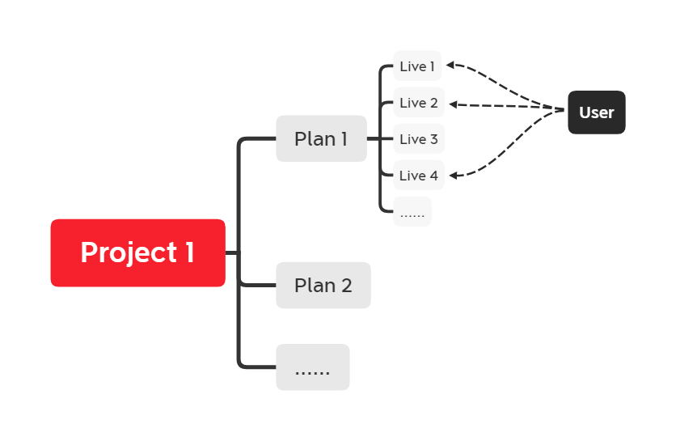

<div style="background-color:rgba(34, 34, 51, 0.51); color: white; padding: 15px; border-left: 6px solid #7575a2;">

**前言**

- 连续登录问题在实际生产过程中可能会有许多不同的变种，实际上底层都为连续登录问题。
- 基本使用窗口函数来解决此类问题，`row_number()` `rank()` `dense_rank()` `lead()` `lag()` 等函数在连续登录问题中为高频函数。
- 本篇为实际生产中遇到的连续登录问题的变种场景。

</div>

***

## 需求描述

以下以直播场景为例。


### 场景

用户使用产品过程中，可能会出现多级场景深入的情况，比如平台上了一个新的直播扶持项目(project)，该项目可能会进行多期计划(plan)，直播扶持项目的主播可以选择其中一期或者多期计划(plan)来参加，每期计划(plan)下可以开启多场直播(live)，用户进入直播间观看直播。

### 需求

某主播已经在一个项目(project)的第一期计划(plan)下进行了多场直播(live)，现在想要提取数据，获取每场直播有多少新用户，多少留存用户。
> 新用户：在本plan下，第一次进入其中一场live的，即为新用户。

> 留存用户：在本plan下，上一场live观看，本场live又观看的，即为留存用户。非n-1场的历史live观看过，本场live也观看的，不算留存用户。**仅有n和n-1场live都观看的用户，才作为留存用户**。

## 建模分析

project、plan、live关系如图



<div style="background-color #4B4B4B; color: white; padding: 15px; border-left: 6px solid #616161;">

**题外话在这个实体关系中聊点建模的内容**

这种多层级关系其实是非常适合建模成为dim层的维度表的，因为三个概念提供了非常丰富的上下文信息，但是在建模的时候也需要考虑一些情况和维度表怎么设计。

类似这种多层级其实可以有两种维度表设计：
- 一种是project、plan、live分别抽象成为维度表`dim_project` `dim_plan` `dim_live`，在三个维度表中使用id进行关联。

    优点：

    - 这种抽象方式的好处是可以清晰定义各个层级之间的关系，在分析的时候通过维度层次结构来向下一级一级钻取。在单独进行高维度的数据分析的时候（比如单独进行项目维度的分析时），数据不会冗余，不需要进行group by或者distinct去重。
    - 可维护性比较高，能够保持维度表独立，单维度信息变化可以直接维护。
    - 不会存在过多的数据冗余。

- 一种是project、plan、live抽象成一张dim的大宽表`dim_project_plan_live`。

    优点：

    - 这种抽象方式对于live粒度，或者多粒度的分析的时候，聚合非常方便，因为一个宽表中包含了所有相关的维度信息。在live粒度轻度聚合成dws层表之后，可以在`dws_live`的基础上进一步聚合成`dws_plan` `dws_project`,
    - 减少了查询的复杂性，不需要join多张dim表，在相对比较小的数据集的时候性能会比上面那种更高。
    - 在多种业务场景都共用该维度关系时，抽象成大宽表能够有效减少开发时间，提高开发效率。

    缺点：

    - 一张大宽表势必会造成数据冗余，维护了更细粒度的live粒度的情况下，上层的project和plan会有大量重复数据。
    - 当前业务场景下，project和plan的信息不会频繁变化，但如果切换成上级节点信息会频繁变化的场景，就需要频繁更新宽表中的数据。
    - 随着业务发展，project和plan的结构发生变化，比如新增字段的时候，维护起来会更复杂，除了新增字段还需要重跑任务来更新dim的数据，在大数据量的场景下，etl花费的时间会变多，维护成本比较高。

</div>

在这个业务场景下，该维度建模在之前的其他业务场景中已经完成了，使用的是第二种，抽象成一张大的dim宽表的形式。原因如下：

- 该业务涉及到的维度层级不会频繁变化，project、plan创建完毕并成功发布后，信息几乎不会变更。更新频率低。
- 该业务涉及到的维度层级，在其他的分析场景中也会使用，plan下不只有live，可能会有node、file等其他的节点类型，在多分析场景的情况下，直接建模大宽表能有效降低开发时间，否则每个业务条线的SQL都需要挨个关联project、plan等。复用程度高。
- 业务数据量级增长缓慢。
- 运营侧在针对live级别的数据查看报表的时候，需要plan、project级别的冗余数据辅助筛选项目信息（如项目开始时间，项目创建者，计划期数等）。
- 该维度关系不关心project、plan、live的信息变化，只需要信息快照，因此可以通过lifecycle完成数据生命周期管理，避免存储占用过高。
- 该业务的原始数据表在表设计中已经有关联思想，即project表、plan表、live表分别有id互相关联。

## 解法

本案例中不涉及表是否分区及其他限制条件，实际业务生产中会有更复杂的业务条件及数据分区，可以在on条件下或者where条件下增加条件进行数据筛选。

### 新用户

如果计算一个计划下有多少新用户，可以直接对user进行`count(distinct user_id)`即可，但本需求需要计算每场直播有多少该计划下的新用户。

```SQL 
SELECT  project_id
          ,plan_id
          ,live_id
          ,count(user_id) first_user_cnt
FROM    (
            SELECT  project_id
                    ,plan_id
                    ,user_id
                    ,live_id
                    ,RANK() OVER (PARTITION BY project_id,plan_id,user_id ORDER BY live_id ASC) rk
            FROM    dws_live_user  -- 聚合了维度信息、用户观看数据的dws表
        ) 
WHERE   rk = 1
GROUP BY project_id
         ,plan_id
         ,live_id

```

### 留存用户

该需求定义的留存用户是指第n和n-1场live都观看的用户为留存用户，这实际上是一个用户留存问题，需要注意的点：

- 用户观看数据表中，用户有可能并非连续观看两场live，有可能观看了第n场和第n-2场，因此无法直接根据用户观看数据来做rank排序，需要先对该plan下所有的live排序，关联后进一步判断用户观看的是否第n场和第n-1场。
- 本场景下关心的是用户观看live的连续性，不关心数据条数，因此用`DENSE_RANK()`函数进行计算，实际上本场景下，同一个project同一个plan下的live是唯一的，实际上也不存在重复的排名。

 |      | ROW_NUMBER()                                                                | RANK()                                                                             | DENSE_RANK()                                                                            |
 |------|-----------------------------------------------------------------------------|------------------------------------------------------------------------------------|-----------------------------------------------------------------------------------------|
 | 定义 | 为每一行数据分配唯一连续的编号，与排名无关，行号                            | 排名相同，分配相同的编号，后续编号跳过名次                                         | 排名相同，分配相同的编号，后续排名连续名次                                              |
 | 示例 | 分数 \| ROW_NUMBER() <br>--------------------------<br> 90  \| 1<br>  90  \| 2<br>  85  \| 3<br>  80  \| 4<br> | 分数 \| RANK() <br>--------------------------<br>  90  \| 1<br>  90  \| 1<br>  85  \| 3 -- 直接跳到3<br>  80  \| 4 | 分数 \| DENSE_RANK() <br>--------------------------<br>  90  \| 1<br>  90  \| 1<br>  85  \| 2 -- 连续名次<br>  80  \| 3 |


```SQL
SELECT  project_id
        ,plan_id
        ,node_id
        ,COUNT(DISTINCT user_id) AS user_cnt_2lives
FROM    (
            SELECT  a.project_id
                    ,a.plan_id
                    ,a.node_id
                    ,a.user_id
                    ,b.rk - LAG(b.rk, 1, - 99999999) OVER(PARTITION BY a.project_id, a.plan_id, a.user_id ORDER BY b.rk ASC) rk_diff
            FROM    (
                        SELECT  a.project_id
                                ,a.plan_id
                                ,a.node_id
                                ,b.user_id
                        FROM    dim_community_space_project_info a
                        JOIN    dws_famous_school_online_living_user_watch_statistics b
                        ON      a.node_id = b.node_id
                    ) a
            LEFT JOIN (
                          SELECT  project_id
                                  ,plan_id
                                  ,node_id
                                  ,DENSE_RANK() OVER(PARTITION BY project_id, plan_id ORDER BY node_id ASC) AS rk
                          FROM    dim_community_space_project_info
                      ) b
            ON      a.node_id = b.node_id
        ) 
WHERE   rk_diff = 1
GROUP BY project_id
         ,plan_id
         ,node_id
;
```
